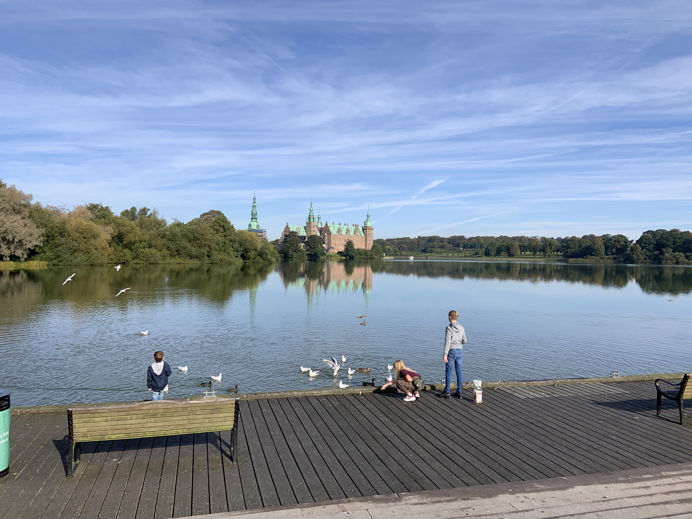

```{r setup, include=FALSE}
knitr::opts_chunk$set(echo = TRUE)
```

## Idea

The idea is to present a walking trip around a castle located in my neighborhood.  
Data from the trip is captured on my watch, the indata file for this project is a GPX file export from <a href= "https://connect.garmin.com" target="blank">https://connect.garmin.com</a>

To reduce the number of positions I will perform a simple generalization of the data. Furthermore, I remember we stopped an looked at the castle. I will detect this stop an mark it on the map.  

  


## Getting and preparing data

Getting the data can be done in a number of ways, I have decided to use the plotKML library.  
The *geospere* library is used for calculating distance between positions.


```{r pressure, message=FALSE}
library(plotKML)
library(tidyverse)
library(geosphere)

# Set minimum distance between positions in generalized track
distanceThreshold <- 23 # meter

# Set minimum time to detect a stop
timeThreshold <- 300 # seconds

# Import GPX data
 trackdata <- readGPX("Walking.gpx")          

trackdata <- trackdata$tracks[[1]][[1]] %>%  # Get track part of imported list
  select(time, lat, lon) %>%                 # Select time, latitude and longitude
  mutate(time = as.POSIXct(time,             # Convert time string to POSIXct
         format="%Y-%m-%dT%H:%M:%OS")) %>%   # specifying format of time string
  slice(6:n())                               # Remove first 5 observations where GPS position is not accurate


# Create a dataframe trackdataPrevious intended for binding to trackdata
# This dataframe contains the data position as trackdata, except the last position is omitted
trackdataPrevious <- trackdata %>%           # Copy trackdata to trackdataPrevious
  slice(1:n()-1) %>%                         # Get all but last row
  rename(timePrev = time,                    # Rename columns
         latPrev = lat,
         lonPrev = lon)

# Bind previous observations to trackdata
trackdata <- trackdata %>%
  slice(2:n()) %>%                           # Remove first observation
  cbind(trackdataPrevious)                   # Bind previous observation to trackdata

# Calculate time and distance, then generalize data
savePositions <- c(1)                        # Initialize vector of positions to save, make sure to save the first one
distanceMoved <- 0                           # Initialize distance moved since last saved position
timeElapsed <- c(0)                          # Initialize vector of elapsed time since last saved position
timer <- 0                                   # Initialize timer since last position
for (i in 1:dim(trackdata)[1]){
  # Create vectors of present and previous position
  previous <- as.numeric(c(trackdata[i, 'lonPrev'], trackdata[i, 'latPrev']))
  present <- as.numeric(c(trackdata[i, 'lon'], trackdata[i, 'lat']))

  # Update distanceMoved and timeElapsed
  distanceMoved <- distanceMoved + distGeo(previous, present)
  timer <- timer + as.integer(difftime(trackdata[i, "time"], trackdata[i, "timePrev"], units = "secs"))

  # Check if this position should be saved in generalized track
  if (distanceMoved >= distanceThreshold) {
    savePositions <- c(savePositions, i)     # Save position
    distanceMoved <- 0                       # Reset distance moved

    timeElapsed <- c(timeElapsed, timer)     # Add timer to timeElapsed vector
    timer <- 0                               # Reset timer
  }
}

# Subset generalized track and calculate time elapsed between positions
trackdataGeneralized <- trackdata[savePositions,] %>%
  cbind(timeElapsed)

# Sub
stops <- trackdataGeneralized %>%
  filter(timeElapsed >= timeThreshold)


```


## Leaflet plot


```{r message=FALSE}

library(leaflet)

# Create stop icon
stopIcon <- makeIcon(iconUrl = "sign_stop.png")

map <- leaflet(width = "100%") %>%
  addTiles() %>%
  addPolylines(lat = trackdataGeneralized$lat, lng = trackdataGeneralized$lon) %>%
  addMarkers(lat = stops$lat,
             lng = stops$lon,
             popup = paste("Stop at least", timeThreshold, "seconds"),
             icon = stopIcon)

map


```


